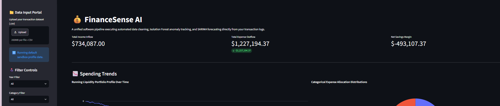
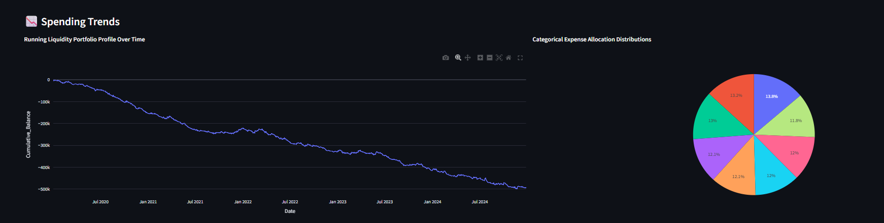
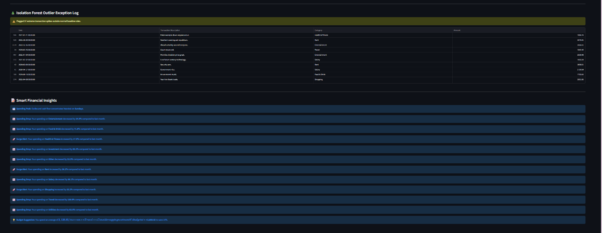

💰 FinanceSense AI

Managing personal finances often requires manually tracking and analyzing transaction histories, which can be time-consuming and prone to oversight. **FinanceSense AI** addresses this challenge by applying unsupervised machine learning, advanced feature engineering, and statistical time-series forecasting to automatically uncover spending patterns, predict future budget liabilities, and flag outlier transactions through an interactive visualization web dashboard.

--- 📌 Overview

FinanceSense AI is an end-to-end personal finance intelligence platform built with Python and Streamlit.

The application enables users to upload custom transaction logs, processes data through an automated data engineering pipeline, identifies behavioral spending profiles, builds baseline-evaluated expense forecasts, and instantly isolates anomalies using an ensemble tree framework.

This project is built to demonstrate a complete data science software deployment—transforming raw, tabular ledger data into high-value natural-language insights.

--- ✨ Features- 📁 
**Data Input Portal**: Drag-and-drop file uploader accepting user-supplied transaction datasets.
- 🧹 **Defensive Data Cleaning**: Automated handling of missing structures and duplicate ledger removal.
- ⚙️ **Advanced Feature Engineering**: Dynamic generation of temporal markers, transaction time deltas, and month-over-month ratio features.
- 🤖 **Behavioral Profile Clustering**: Groups monthly expenditure patterns using K-Means, using Silhouette Score width sweeps to pick the optimal number of clusters.
- 🔮 **Predictive Forecast Horizons**: Generates multi-month outbound expense projections using seasonal SARIMA models backed by 95% confidence intervals.
- 🌲 **Unsupervised Anomaly Tracking**: Pinpoints irregular or potentially hazardous spending surges via an Isolation Forest framework.
- 📝 **Dynamic Financial Insights**: Evaluates data velocities to surface custom natural-language trend updates and personalized budget cap recommendations.

---## 🏗️ Project Architecture

To facilitate seamless local installation, swift visualization adjustments, and rapid prototyping, the entire engineering pipeline is contained within a clean, production-ready standalone repository layout:

FinanceSense-AI/
│
├── app.py # Core UI, Pipeline Orchestration, & ML Engines
├── requirements.txt # Operational dependency requirements
└── data/
└── Sample_Dataset.csv # Baseline sandbox fallback dataset

🔄 Machine Learning Pipeline
Plaintext

Upload CSV Dataset
        │
        ▼
Data Preprocessing (Deduplication & Numeric Sign Normalization)
        │
        ▼
Feature Engineering (Temporal Extraction & Transaction Deltas)
        │
        ▼
Behavioral Clustering (K-Means Optimized via Silhouette Score)
        │
        ▼
Expense Forecasting (SARIMA with 95% Confidence Intervals)
        │
        ▼
Anomaly Detection (Isolation Forest Outlier Exception Logging)
        │
        ▼
Synthesized Insights (Automated Natural-Language Alerts)
        │
        ▼
Interactive UI Dashboard (Streamlit Frontend Execution)

🧹 Data Preprocessing & Feature Engineering
The underlying data engine ingests raw inputs and automatically structures features to supply the downstream machine learning models:

Structural Integrity: Drops entries lacking critical currency values and fills empty descriptors securely.
Deduplication Check: Automatically isolates and purges identical transaction records to protect model variances.
Temporal Indicators: Extracts Year, Month, Quarter, WeekOfYear, and Is_Weekend binary flags.
Continuous Metrics: Tracks DaysSincePreviousTransaction and compiles a chronological running account balance vector.

🤖 Machine Learning Models
Automated K-Means Clustering
Segments monthly transactional activities into unique financial archetypes. Rather than manually assigning a static number of groupings, the system computes Silhouette Coefficients across a range of values (K∈[2,5]) at runtime to choose the mathematically optimal cluster size for your specific spending distribution.

SARIMA Forecasting with 95% Confidence Intervals
Projects baseline expense patterns over a future horizon. To guarantee performance, the model fits a seasonal state-space autoregressive tracker (SARIMAX) using derivative-free optimization routines and charts an orange median prediction path complete with faded 95% confidence boundaries. The script logs a 3-month Moving Average baseline for performance context.

Isolation Forest Outlier Log
Isolates anomalous, high-risk financial spikes. By training an unsupervised ensemble of isolation trees on transaction amounts and transaction velocities, the application strips out and tables the top 3% most statistically abnormal transaction rows for immediate user audit.

📊 Dashboard Elements
The interactive interface translates multi-layered mathematical metrics into a scannable user layout:

Inflow/Outflow Scorecards: Real-time evaluation of total income, aggregate expenses, and net savings.
Dynamic Liquidity Timelines: Interactive Plotly line charts displaying running cash balances over selectable year profiles.
Categorical Allocation Distributions: Proportional breakdown charts profiling budget use across transaction types.
Tabular Exception Log: Visual warning panels containing flagged Isolation Forest transaction outliers.

⚠️ Known Limitations
Historical Volume Dependencies: The accuracy of the seasonal SARIMA forecasting module is highly dependent on having a multi-year historical timeline; short or highly random sequences will cause the engine to degrade to moving average baselines.
Schema Constraints: The input system assumes user uploads adhere to standard categorical column naming conventions (Date, Transaction Description, Category, Amount, Type).
Rule-Based Category Mapping: Initial transaction classification profiles rely on underlying string matching rule matrices that may require expansion depending on user-specific merchant variations.

🛠️ Technologies Used
Language Runtime: Python
Interface & Server: Streamlit
Data Engineering: Pandas, NumPy
Visualizations: Plotly Express, Plotly Graph Objects
Machine Learning: Scikit-Learn (KMeans, StandardScaler, IsolationForest, silhouette_score)
Time-Series Analysis: Statsmodels (SARIMAX state-space framework)

🚀 Installation & Setup
Clone the Repository

git clone https://github.com/yourusername/FinanceSense-AI.git
cd FinanceSense-AI

Install Required Packages

pip install -r requirements.txt

Launch the Web Application

streamlit run app.py

📸 Screenshots

### Operational Analytics Dashboard

### Spending Explorations

### Machine Learning Profile Groupings & SARIMA Horizon Projections

### Isolation Forest Outlier Exceptions & Automated Insights

🔮 Future Improvements
Automated multi-currency processing for international accounts.
Dynamic categorization using localized LLM classification pipelines.
Predictive budget recommendation engines that optimize savings dynamically.

👤 Author
Leen Qaddoumi Data Science & Artificial Intelligence Student Al Hussein Technical University